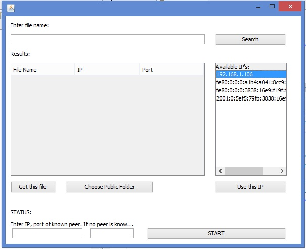

# filebus
Instructions to run:  

If running 2 instances on the same computer:
	Run under 2 different ports
	Select any network ip and click 'Use this ip'

If running two computers on the same network:
	Run one instance on each.Give any ports
	Select ip from the given network and click 'Use this ip'

After selecting ip, you can query for files.

